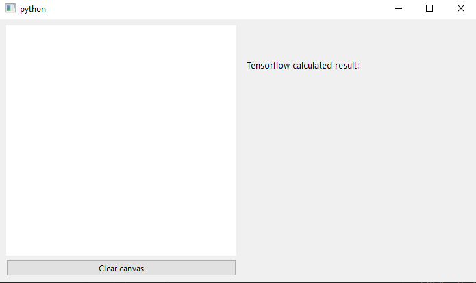

# Number Identifier

# Overview
This program impliments an AI trained number identification canvas that can be used to identify any drawn numbers 0-9. The UI utilizes pyside6 and the AI uses tensorflow to identify the number drawn. 

# Methodology
This AI program utilizes the tensorflow's implimentation of keras to train the data based on custom images supplied. I have uploaded 200 handdrawn images for training purposes, but the model would work much better if there were many more, possibly added by you. The usage of pyside6 allows the user to draw onto a canvas, any number from 0 through 9, which will then be identified as a number at the end of a clickstroke. The resulting tensorflow's predicted number and statistics will be printed on the righthand side. 

# Installation

This project requires [Python](https://www.python.org/downloads/) to run, and the following main modules:

- [Tensorflow](https://www.tensorflow.org/)
- [Pyside6](https://pypi.org/project/PySide6/)
- [Numpy](https://numpy.org/)
- [CV2](https://pypi.org/project/opencv-python/)

Run ```python -m pip install -r requirements.txt``` to install all required modules

# Usage

After installing the required modules using the above command, you can then launch the GUI by typing  
```python main.py```  
The program will read in the images in the data folder, and then train the tensorflow model.  
You will then see the launched window, as shown below:



The left side of the screen can be used to paint a number. Hovering over the canvas, press the left click button, and hold down while moving the cursor to draw a number. When you release the click, the trained model will then predict the number you have drawn.

# Example


